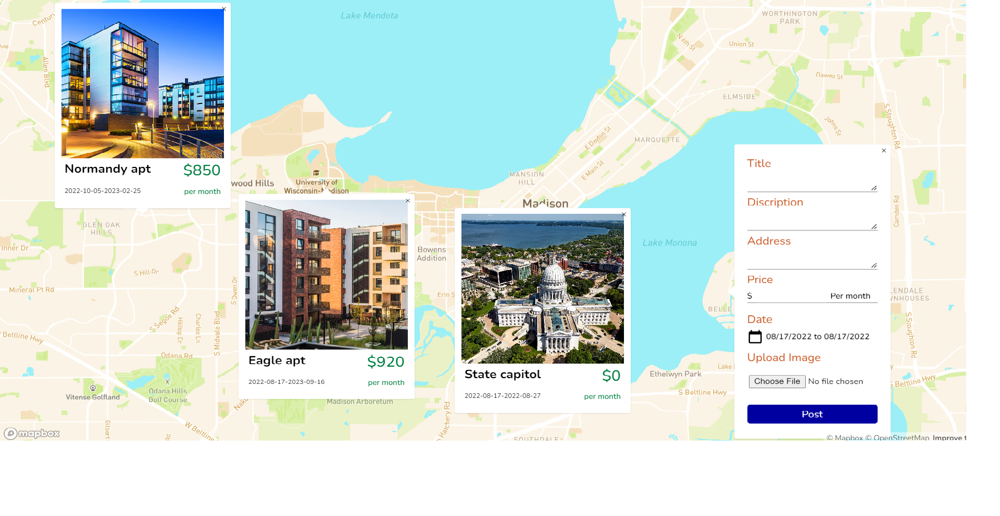

# About The Project
This is a practice project when I learn how to use mapbox, this app can help people find short lease directly on the map
# Installation & Built with
This app is build with django django-restframework react and mapbox, You can download the file and run django manage.py runserver to run the app.  
# Features
user registion, email activation, searching lease on map or post a lease on the map
# Screenshots
 
 
 
